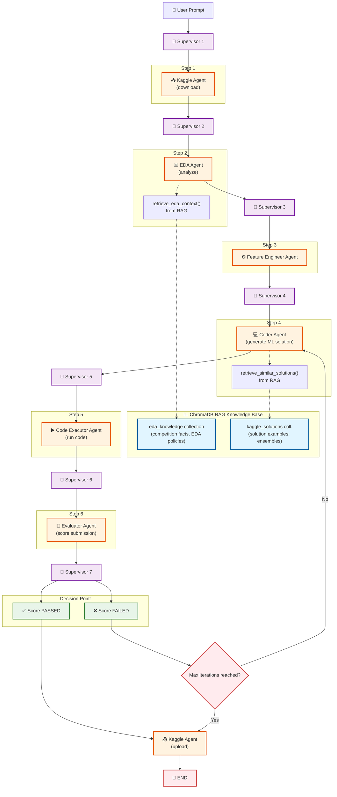

# Multi-Agent Kaggle Competition Solver

A LangGraph-based multi-agent system that autonomously solves Kaggle competitions — from data download through EDA, feature engineering, model training, evaluation, and submission upload.

---

## Table of Contents

- [Overview](#overview)
  - [Key Design Principles](#key-design-principles)
  - [Tech Stack](#tech-stack)
- [Architecture](#architecture)
  - [High-Level Flow](#high-level-flow)
- [Agent Descriptions](#agent-descriptions)
  - [Supervisor Agent](#supervisor-agent)
  - [Kaggle Agent](#kaggle-agent)
  - [EDA Agent](#eda-agent)
  - [Feature Engineering Agent](#feature-engineering-agent)
  - [Coder Agent](#coder-agent)
  - [Code Executor Agent](#code-executor-agent)
  - [Evaluator Agent](#evaluator-agent)
- [Shared State](#shared-state)
- [RAG Knowledge Base](#rag-knowledge-base)
  - [Solution Store](#solution-store-vector_store)
  - [EDA Store](#eda-store-eda_store)
- [Security & Guardrails](#security--guardrails)
  - [Input Validation](#input-validation)
  - [Code Guardrails](#code-guardrails)
  - [Agent Monitoring](#agent-monitoring)
- [Workflow Execution](#workflow-execution)
  - [Initialization](#initialization)
  - [Execution Loop](#execution-loop)
  - [Iteration Flow](#iteration-flow-typical-run)
  - [Final Summary](#final-summary)
- [Configuration](#configuration)
  - [LLM Temperature Settings](#llm-temperature-settings)
- [Dependencies](#dependencies)
- [Usage](#usage)
- [Example Output](#example-output)

---

## Overview

The system orchestrates six specialized agents under a central supervisor to autonomously tackle ML competitions on Kaggle. Each agent handles one phase of the data science pipeline —  EDA, feature engineering, model training, evaluation.

```
User Prompt
    │
    ▼
┌────────────┐
│ Supervisor │ ◄─── LLM-driven routing with safety overrides
└─────┬──────┘
      │ routes to one of:
      ├──► Kaggle Agent ──────► Download data / Upload submission
      ├──► EDA Agent ─────────► Analyze dataset statistics & patterns
      ├──► Feature Engineer ──► Generate feature engineering code
      ├──► Coder Agent ───────► Write full ML solution (RAG-assisted)
      ├──► Code Executor ─────► Run & validate generated code
      ├──► Evaluator Agent ───► Score submission against ground truth, suggests improvements
      │
      └──► END
```

### Key Design Principles

**Retrieval-Augmented Generation (RAG)**
The system uses two ChromaDB vector stores to provide domain knowledge to agents at runtime. The **EDA Agent** retrieves competition-specific facts, analysis policies, and known pitfalls from the `eda_knowledge` collection via `retrieve_eda_context()`. The **Coder Agent** retrieves similar past solutions, encoding patterns, and ensemble strategies from the `kaggle_solutions` collection via `retrieve_similar_solutions()`. This allows agents to make informed decisions grounded in curated examples rather than relying solely on the LLM's parametric knowledge. All documents are embedded using the `all-MiniLM-L6-v2` model and retrieved by semantic similarity.

**Information Flow: Shared State + Supervisor Prompts**
Agents do not communicate directly with each other. Instead, information flows through two complementary mechanisms:

1. **Shared State (`AgentState`)** — A typed dictionary that every agent reads from and writes to. When the EDA Agent completes its analysis, it writes `eda_summary` and `eda_rag_context` to the state. When the Coder Agent runs next, it reads those fields to understand the dataset. Similarly, evaluation scores (`eval_score`, `eval_improvements`), solution code (`solution_code`, `solution_path`), error history (`error_history`, `validation_errors`), and best-ever tracking (`best_eval_score`, `best_submission_path`) all propagate through the shared state.

2. **Supervisor Prompts** — The supervisor constructs a detailed state summary and includes it in its LLM prompt to decide the next agent. When routing to an agent, the supervisor generates a natural language `instruction` that carries context the target agent needs. For example, when routing to the Coder Agent after a failed evaluation, the supervisor includes the exact error messages, the current score, the EDA summary, and specific improvement suggestions from the evaluator — all packed into the instruction text. This means each agent receives both structured data (from state) and contextual guidance (from the supervisor's prompt).

**Iterative Improvement Loop**
The system does not stop after the first solution attempt. After the Evaluator scores a submission, if the score does not meet the threshold, the Supervisor routes back to the Coder Agent with feedback — including the error distribution, improvement suggestions, and the previous solution code. The Coder generates an improved solution, which is executed and evaluated again. This loop continues until the score passes or the maximum iteration limit is reached. A best-ever tracking mechanism ensures that score regression across iterations does not lose the best submission found so far.

**Security and Guardrails**
All LLM-generated code passes through AST-based static analysis (`CodeGuardrails`) before execution, blocking dangerous imports, function calls, and sandbox escape patterns. An `AgentMonitor` wraps every agent node, tracking latency, error counts, and enforcing a kill switch if thresholds are exceeded. Input paths are validated against traversal attacks before any file operations.

### Tech Stack

- **LLM**: Qwen3-32B via Groq API
- **Orchestration**: LangGraph (StateGraph with conditional edges)
- **RAG**: ChromaDB + HuggingFace `all-MiniLM-L6-v2` embeddings
- **ML Libraries**: scikit-learn, XGBoost, LightGBM

---

## Architecture

### High-Level Flow




```
1. Supervisor  → kaggle_agent           (download competition data)
2. Supervisor  → eda_agent              (analyze training data)
3. Supervisor  → feature_engineer_agent (generate feature engineering code)
4. Supervisor  → coder_agent            (generate solution code, incorporating features)
5. Supervisor  → code_executor          (run and validate code)
6. Supervisor  → evaluator_agent        (score the submission)
7. If passed   → kaggle_agent           (upload to Kaggle) → END
   If failed   → coder_agent            (improve solution) → loop back to step 5
```

---

## Agent Descriptions

### Supervisor Agent

**Cell**: 33 | **Model**: `qwen/qwen3-32b` | **Temperature**: 0

The supervisor is the orchestrator. It reads the full agent state, constructs a summary, and asks the LLM to return a JSON decision:

```json
{"next_agent": "agent_name_or_END", "instruction": "detailed instruction for the agent"}
```

Supervisor can deside to terminate the program early:
- After 3 failed evaluation cycles, the supervisor decides to terminate early and routes to `END`.
- If the iteration count exceeds 40, the supervisor forces an early finish regardless of the current score.

---

### Kaggle Agent

**Cell**: 17–19 | **Model**: `qwen/qwen3-32b` | **Temperature**: 0

Handles interaction with the Kaggle platform through two tools:

#### Tools

| Tool | Description |
|---|---|
| `download_competition_files(competition_name, download_dir)` | Downloads all competition files using `kagglehub`. Returns file paths mapped by name. |
| `upload_submission(competition_name, submission_path, message)` | Uploads a CSV submission to Kaggle via the Kaggle API CLI. |

#### Behavior

- On **download**: Saves files to `~/Downloads/competitions/{competition_name}/`, returns a dict mapping filenames (without extension) to absolute paths.
- On **upload**: Validates the file exists, runs `kaggle competitions submit`.
- The agent uses an LLM with tool-calling to decide which tool to invoke based on the supervisor's instruction.

#### State Updates

| Field | Description |
|---|---|
| `dataset_paths` | Dict of `{name: path}` for downloaded files |
| `submission_uploaded` | `True` after successful upload |

---

### EDA Agent

**Cell**: 24–25 | **Model**: `qwen/qwen3-32b` | **Temperature**: 0

Performs exploratory data analysis on the training dataset.

#### Process

1. **Raw statistics gathering** (`get_column_info`):
   - Shape, dtypes, null counts, unique counts
   - Per-column: mean, std, min/max, quartiles (numeric) or top values and frequencies (categorical)
   - Target variable distribution analysis

2. **RAG context retrieval** (`retrieve_eda_context`):
   - Asks the LLM to generate a RAG search query from the raw stats
   - Queries the `eda_store` ChromaDB collection
   - Filters results by relevance score (threshold: 1.5)

3. **LLM analysis**:
   - Sends raw stats + RAG context to the LLM
   - Produces a structured EDA summary covering: task type, target analysis, feature types, missing values, recommendations

#### State Updates

| Field | Description |
|---|---|
| `eda_summary` | Structured text summary of the dataset |
| `eda_rag_context` | RAG-retrieved EDA knowledge used |

---

### Feature Engineering Agent

**Cell**: 27 | **Model**: `qwen/qwen3-32b` | **Temperature**: 0.3

Generates feature engineering code based on the EDA summary and data sample.

#### Process

1. Reads a sample of the training data (first 5 rows).
2. Sends the EDA summary + data sample to the LLM.
3. LLM generates a Python code snippet for feature engineering.
4. Code is stored in state for the coder agent to incorporate.

#### Constraints

- Called **at most once** per workflow.
- Must not create features derived from the target column (data leakage prevention).

#### State Updates

| Field | Description |
|---|---|
| `feature_eng_code` | Python code snippet for feature engineering |

---

### Coder Agent

**Cell**: 21–22 | **Model**: `qwen/qwen3-32b` | **Temperature**: 0.6

The most complex agent. Generates complete, self-contained Python solutions for the competition.

#### RAG Tool

| Tool | Description |
|---|---|
| `retrieve_similar_solutions(query)` | Queries the `vector_store` ChromaDB for similar past solutions. Returns top-3 matches with code, task type, and description. |

#### Multi-Candidate Generation

The coder generates **2 candidate solutions** per invocation using different strategies:

| Candidate | Strategy | Temperature |
|---|---|---|
| Candidate 1 | Diverse/alternative approach | 0.7 |
| Candidate 2 | Conservative refinement | 0.4 |

#### Code Extraction Pipeline

```
LLM Response
    │
    ▼
Strip <think> blocks
    │
    ▼
Extract ```python``` code blocks
    │
    ▼
Select best block (by heuristics: contains imports, train/test logic, submission creation)
    │
    ▼
Post-process:
  - Fix common issues (NaN in submission, target leakage patterns)
  - Inject CV scoring if missing
  - Validate Python syntax via ast.parse()
    │
    ▼
Save to disk as .py files
```

#### State Updates

| Field | Description |
|---|---|
| `solution_code` | The generated Python code |
| `solution_path` | Path to saved .py file |
| `candidate_paths` | List of all candidate .py file paths |
| `coder_reasoning` | LLM's reasoning about the approach |

---

### Code Executor Agent

**Cell**: 29 

Runs the generated solution code in a subprocess and validates the output.

#### Process

1. **Guardrail check**: Runs `CodeGuardrails.check_code()` on each candidate.
2. **sklearn parameter sanitization**: Uses `get_valid_params()` to introspect sklearn estimators and `sanitize_sklearn_params()` to remove invalid hyperparameters from the code.
3. **Execution**: Runs each candidate as a subprocess with a timeout.
4. **CV RMSE extraction**: Parses stdout for `CV MSE: <value>` to get cross-validation score.
5. **Best candidate selection**: Picks the candidate with the lowest CV RMSE.
6. **Best-ever tracking**: Compares against the best score seen across all iterations.

#### Per-Candidate Execution (`_run_single_candidate`)

```
Load candidate .py file
    │
    ▼
CodeGuardrails.check_code()  →  Block if dangerous
    │
    ▼
subprocess.run(python candidate.py, timeout=120s)
    │
    ▼
Check for submission.csv output
    │
    ▼
Extract CV RMSE from stdout
    │
    ▼
Return (success, cv_rmse, submission_path)
```

#### Error Enrichment

When execution fails, `enrich_error_with_data_context()` adds dataset information (column names, dtypes, sample values) to the error message, helping the coder agent fix data-specific issues.

#### State Updates

| Field | Description |
|---|---|
| `code_validated` | `True` if at least one candidate ran successfully |
| `validation_errors` | Error messages if execution failed |
| `submission_path` | Path to the best submission CSV |
| `cv_score` | Cross-validation score string |
| `best_eval_score` | Best MSE seen across all iterations |
| `best_submission_path` | Submission file for the best score |
| `best_solution_code` | Code that produced the best score |

---

### Evaluator Agent

**Cell**: 31 | **Model**: `qwen/qwen3-32b` | **Temperature**: 0

Scores submissions against the ground truth solution and provides improvement suggestions.

#### Tools

| Tool | Description |
|---|---|
| `validate_submission_format(submission_path)` | Checks CSV format: required columns, NaN predictions, negative values, row count match. |
| `score_submission(solution_path, submission_path)` | Computes MSE between submission predictions and ground truth. Also generates per-bin error analysis. |

#### Scoring Process

1. **Format validation**: Checks column names, NaN count, prediction range.
2. **MSE computation**: Deterministic — compares `prediction` column against `solution.csv`.
3. **Error bin analysis**: Splits predictions into bins by target value and computes per-bin MSE to identify systematic weaknesses.
4. **PASS/FAIL determination**: Compares MSE against `MSE_THRESHOLD` (default: 10,000).
5. **LLM improvement suggestions**: If the score fails, the LLM analyzes the error distribution and suggests targeted improvements.

#### Plateau Detection

The evaluator tracks a history of scores (`eval_history`). If the last 3 scores are within 2% of each other, it triggers plateau-specific suggestions (e.g., switch to stacking ensemble).

#### State Updates

| Field | Description |
|---|---|
| `eval_score` | Current MSE score |
| `eval_passed` | `True` if MSE ≤ threshold |
| `eval_trace` | Buffered observability trace |
| `eval_improvements` | List of suggested improvements |
| `best_eval_score` | Updated if current score is best-ever |

---

## RAG Knowledge Base

Two ChromaDB vector stores provide domain knowledge to the agents:

### Solution Store (`vector_store`)

**Collection**: `kaggle_solutions` | **Embeddings**: `all-MiniLM-L6-v2`

Contains curated ML solution examples that the coder agent retrieves for reference. Each document includes:
- Competition name and task type
- Description of the approach
- Complete code example
- Notes on pitfalls and best practices

#### Stored Examples

| Topic | Category |
|---|---|
| Regression mixed features template | `regression` |
| Kaggle common pitfalls | `pitfalls` |
| Stacking ensemble regression | `ensemble` |
| Overfitting CV-eval gap | `pitfall` |
| Systematic bias correction | `pitfall` |
| LightGBM + XGBoost regression | `regression` |
| Safe label encoding (unseen categories) | `preprocessing` |
| Polynomial features (no duplicates) | `feature_engineering` |
| Generic feature engineering patterns | `feature_engineering` |
| House prices advanced regression | `regression` |
| Used cars price prediction | `regression` |
| Zero-inflated regression handling | `regression` |
| Target encoding for high-cardinality | `encoding` |
| Real estate mixed types preprocessing | `data_preprocessing` |

### EDA Store (`eda_store`)

**Collection**: `eda_knowledge` | **Embeddings**: `all-MiniLM-L6-v2`

Contains EDA policies and domain knowledge:

| Category | Examples |
|---|---|
| **Competition facts** | Target descriptions, feature lists, known quirks |
| **EDA policies** | Regression checklist, classification checklist, schema validation, feature type detection |
| **Pitfall docs** | Zero-inflation, one-hot explosion, target leakage, datetime issues, high-cardinality drops, CV-eval gap, systematic bias |

---

## Security & Guardrails

### Input Validation

**Class**: `InputValidator`

Prevents path traversal attacks in LLM-generated file paths:

```python
InputValidator.validate_llm_output_as_path(path, allowed_root)
# Returns (is_safe: bool, resolved_path_or_error: str)
```

- Blocks `..` traversal, absolute paths outside allowed root, and symlink escapes.

### Code Guardrails

**Class**: `CodeGuardrails`

AST-based static analysis of LLM-generated code before execution:

```python
CodeGuardrails.check_code(code, work_dir)
# Returns (is_safe: bool, issues: List[str])
```

#### Blocked Patterns

| Category | Blocked Items |
|---|---|
| **Imports** | `os`, `sys`, `subprocess`, `shutil`, `socket`, `http`, `requests`, `ctypes`, `pickle`, `shelve`, `importlib` |
| **Function calls** | `exec`, `eval`, `compile`, `__import__`, `globals`, `locals`, `getattr`, `setattr`, `delattr` |
| **Dunder attributes** | `__subclasses__`, `__bases__`, `__globals__`, `__builtins__`, `__code__`, `__reduce__` |
| **Regex fallbacks** | String-based evasion patterns like `getattr(`, `__import__(` |

Additional checks:
- **Code size limit**: Rejects code over a configurable character threshold.
- **File write counting**: Warns if code writes more than a set number of files.
- **Network call detection**: Warns (but doesn't block) on potential network calls.

### Agent Monitoring

**Class**: `AgentMonitor`

Runtime monitoring system wrapping every agent node via the `monitored_node()` decorator:

```python
@monitored_node("agent_name")
def agent_node(state):
    ...
```

#### Features

| Feature | Description |
|---|---|
| **Latency tracking** | Records execution time per agent per call |
| **Error counting** | Tracks errors per agent with configurable thresholds |
| **Iteration tracking** | Counts total workflow iterations |
| **Alert system** | Generates alerts for anomalies (high latency, repeated errors) |
| **Kill switch** | `should_stop()` returns `True` if error thresholds are exceeded |
| **Summary report** | `get_summary()` prints runtime stats, error counts, avg latency per agent |

#### Kill Switch Conditions

- Single agent exceeds error threshold (default: 5 errors).
- Total iteration count exceeds maximum (default: 60).

---

## Workflow Execution

### Initialization

```python
initial_state = {
    "messages": [HumanMessage(content=user_prompt)],
    "competition_name": COMPETITION_NAME,
}
```

### Execution Loop

The graph runs via `app.stream()` with a recursion limit of 60:

```python
for output in app.stream(initial_state, {"recursion_limit": 60}):
    for key, value in output.items():
        # Process each agent's output
```

### Iteration Flow (Typical Run)

```
Iteration 0:  Supervisor → kaggle_agent (download)
Iteration 1:  Supervisor → eda_agent (analyze)
Iteration 2:  Supervisor → coder_agent (generate solution)
Iteration 3:  Supervisor → code_executor (run code)
Iteration 4:  Supervisor → evaluator_agent (score)
Iteration 5:  Supervisor → coder_agent (improve) ← if score too high
...
Iteration N:  Supervisor → kaggle_agent (upload) → END
```

### Final Summary

After the workflow completes, a submission log is printed:

```
--- SUBMISSION LOG ---
Best-ever MSE: <score>
Threshold: <threshold>
Passed: <True/False>
Uploaded to Kaggle: <True/False>
Best submission file: <path>
  Shape: (rows, cols)
  Columns: ['index', 'prediction']
  Prediction range: <min> to <max>
Score history: <score1> -> <score2> -> ...
--- END LOG ---
```

---

## Configuration

| Parameter | Default | Location | Description |
|---|---|---|---|
| `QWEN_MODEL` | `"qwen/qwen3-32b"` | Cell 11 | LLM model identifier on Groq |
| `COMPETITION_NAME` | `"mws-ai-agents-2026"` | Cell 11 | Target Kaggle competition slug |
| `MSE_THRESHOLD` | `10000` | Cell 31 | Score threshold for PASS/FAIL |
| `MAX_ITERATIONS` | `60` | Cell 33 | Hard limit on supervisor iterations |
| `app.step_timeout` | `600` | Cell 34 | Timeout per graph step (seconds) |
| `recursion_limit` | `60` | Cell 34 | LangGraph recursion limit |

### LLM Temperature Settings

| Agent | Temperature | Rationale |
|---|---|---|
| Supervisor | 0.0 | Deterministic routing decisions |
| EDA Agent | 0.0 | Factual analysis |
| Evaluator | 0.0 | Consistent scoring |
| Feature Engineer | 0.3 | Slight creativity for feature ideas |
| Coder Agent | 0.6 | Balance between creativity and correctness |
| Coder Candidate 1 | 0.7 | Diverse/alternative approaches |
| Coder Candidate 2 | 0.4 | Conservative refinement |

---

## Dependencies

```
# Core
langchain
langchain-core
langchain-groq
langgraph

# RAG
langchain-chroma
langchain-community
langchain-huggingface
sentence-transformers
chromadb

# ML
scikit-learn
xgboost
lightgbm
pandas
numpy

# Kaggle
kaggle
kagglehub

# API
groq
python-dotenv
```

---

## Usage

### 1. Set Up Credentials

```python
# Groq API key
os.environ['GROQ_API_KEY'] = 'your-groq-api-key'

# Kaggle credentials
os.environ['KAGGLE_USERNAME'] = 'your-username'
os.environ['KAGGLE_KEY'] = 'your-kaggle-key'
```

### 2. Configure Competition

```python
COMPETITION_NAME = "your-competition-slug"
```

### 3. Run All Cells

Execute all notebook cells sequentially. The workflow starts automatically in the final cell and streams progress to stdout.

### 4. Monitor Progress

The output stream shows:
- Which agent is active and what it's doing
- Dataset discovery and EDA results
- Code generation and execution logs
- Evaluation scores and improvement suggestions
- Final submission status

---

## Example Output

```
Starting Workflow
Competition: mws-ai-agents-2026
============================================================

Node: supervisor
  ➡️ Next: kaggle_agent
  📝 Download the competition dataset files

Node: kaggle_agent
  ✅ Downloaded 4 files
  Dataset: ['sample_submition', 'solution', 'test', 'train']

Node: eda_agent
  EDA: 15 columns, 36000 rows, regression task...

Node: coder_agent
  Generated 2 candidates: solution_candidate_1.py, solution_candidate_2.py

Node: code_executor_agent
  ✅ CV RMSE=102.27
  Best candidate: solution_candidate_2.py

Node: evaluator_agent
  Eval MSE: 10459.86, Passed: False
  Improvements: ["Try stacking ensemble", "Add interaction features"]

...

Workflow Complete!
--- SUBMISSION LOG ---
Best-ever MSE: 10282.69
Threshold: 10000
Passed: False
Score history: 10310 -> 10283 -> 10368 -> 10390
--- END LOG ---

MONITORING SUMMARY
Total runtime: 431.8s
Events logged: 86
Avg latency: coder_agent 34.6s, code_executor 15.3s, eda_agent 10.5s
```

---